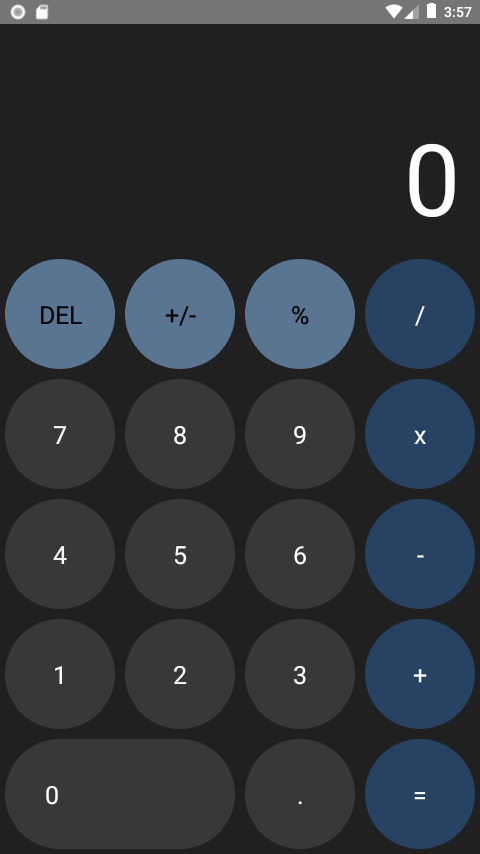

<h1 align="center">
  
  <br>
  Calculator
  <br>
</h1>

<p align="center">Very simple calculator, very similar to iOS. To do basic operations.</p>

<br>

<p align="center">
  
</p>

## 🛠 Technologies
This project was developed with the following technologies:

- [React Native](https://facebook.github.io/react-native/)
- [Javascript](https://devdocs.io/javascript/)
- [Node](https://nodejs.org/en/)

## 📱 How To Use 

To execute the project it is necessary that you have the React Native environment configured, you can follow this [GUIA](https://reactnative.dev/docs/environment-setup).

After setting up the environment, just clone the project:

```sh
git clone https://github.com/JhonatanBergmann/simple-calculator.git
```

Enter the project folder and run the command to install the project's dependencies:

```sh
yarn install
```
or
```sh
npm install
```

Then run the command for the platform you want to run on:

Android:

```sh
react-native run-android
```

iOS:

```sh
react-native run-ios
```

## 🤔 How to contribute

-  Make a fork;
-  Create a branch with your feature: `git checkout -b my-feature`;
-  Commit changes: `git commit -m 'feat: My new feature'`;
-  Make a push to your branch: `git push origin my-feature`.

After merging your receipt request to done, you can delete a branch from yours.

<p align="center">
 Made with ♥ by Jhonatan Bergmann
</p>
